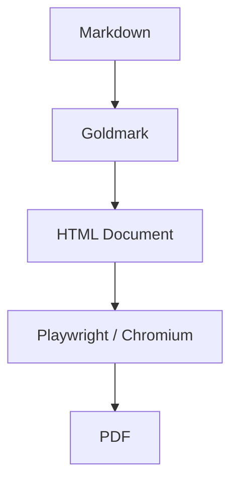

# md2pdf Example

A demonstration document with **bold**, _italic_, and `inline code`.

## Code Block

```go
package main

import "fmt"

func main() {
    fmt.Println("Hello, md2pdf!")
}
```

## Table

| Feature          | Status |
| ---------------- | ------ |
| Markdown         | ✅     |
| Syntax highlight | ✅     |
| Mermaid diagrams | ✅     |
| PDF output       | ✅     |

## Mermaid Diagram



## Wide Table

| ID | Name | Role | Team | Location | Status | Start Date | End Date | Priority | Effort | Risk | Dependency | Owner | Reviewer | Notes |
|----|------|------|------|----------|--------|------------|----------|----------|--------|------|------------|-------|----------|-------|
| 1 | Authentication Service | Backend | Platform | Dublin | In Progress | 2026-01-10 | 2026-03-31 | High | Large | Medium | Identity Provider | Alice | Bob | Requires OAuth2 integration |
| 2 | Dashboard Redesign | Frontend | UX | Remote | Planned | 2026-02-01 | 2026-04-15 | Medium | Medium | Low | Design System | Carol | Dave | Awaiting design approval |
| 3 | Data Pipeline | Data Engineering | Analytics | New York | Blocked | 2026-01-20 | 2026-05-01 | High | XL | High | Kafka Cluster | Eve | Frank | Blocked on infra provisioning |
| 4 | Mobile App v2 | iOS/Android | Mobile | London | In Progress | 2026-01-15 | 2026-06-30 | High | XL | Medium | Auth Service | Grace | Heidi | Cross-platform using React Native |
| 5 | Reporting Module | Backend | BI | Remote | Planned | 2026-03-01 | 2026-05-15 | Low | Small | Low | Data Pipeline | Ivan | Judy | Optional for Q2 |

## Tall Table

| # | Task | Status | Owner | Due |
|---|------|--------|-------|-----|
| 1 | Define project scope | Done | Alice | 2026-01-05 |
| 2 | Set up CI pipeline | Done | Bob | 2026-01-08 |
| 3 | Design system architecture | Done | Carol | 2026-01-12 |
| 4 | Write ADRs | Done | Dave | 2026-01-15 |
| 5 | Provision dev environment | Done | Eve | 2026-01-18 |
| 6 | Implement auth service | In Progress | Frank | 2026-02-01 |
| 7 | Implement user API | In Progress | Grace | 2026-02-08 |
| 8 | Implement admin API | Not Started | Heidi | 2026-02-15 |
| 9 | Design database schema | Done | Ivan | 2026-01-20 |
| 10 | Write migration scripts | In Progress | Judy | 2026-02-01 |
| 11 | Set up staging environment | Not Started | Kevin | 2026-02-10 |
| 12 | Load testing | Not Started | Laura | 2026-02-20 |
| 13 | Security audit | Not Started | Mallory | 2026-02-25 |
| 14 | Write API documentation | Not Started | Niall | 2026-03-01 |
| 15 | Write user guide | Not Started | Olivia | 2026-03-05 |
| 16 | Implement notification service | Not Started | Paul | 2026-03-08 |
| 17 | Implement reporting module | Not Started | Quinn | 2026-03-12 |
| 18 | UI integration testing | Not Started | Ruth | 2026-03-15 |
| 19 | Accessibility review | Not Started | Sam | 2026-03-18 |
| 20 | Performance optimisation | Not Started | Tara | 2026-03-22 |
| 21 | Deploy to staging | Not Started | Uma | 2026-03-25 |
| 22 | UAT sign-off | Not Started | Victor | 2026-03-28 |
| 23 | Deploy to production | Not Started | Wendy | 2026-04-01 |
| 24 | Post-launch monitoring | Not Started | Xena | 2026-04-08 |
| 25 | Retrospective | Not Started | Yusuf | 2026-04-15 |
| 26 | Patch release 1.0.1 | Not Started | Alice | 2026-04-22 |
| 27 | Update dependencies | Not Started | Bob | 2026-04-25 |
| 28 | Refactor auth module | Not Started | Carol | 2026-04-28 |
| 29 | Add rate limiting | Not Started | Dave | 2026-05-02 |
| 30 | Implement caching layer | Not Started | Eve | 2026-05-05 |
| 31 | Database index review | Not Started | Frank | 2026-05-08 |
| 32 | Add audit logging | Not Started | Grace | 2026-05-12 |
| 33 | GDPR compliance check | Not Started | Heidi | 2026-05-15 |
| 34 | Penetration testing | Not Started | Ivan | 2026-05-19 |
| 35 | Fix security findings | Not Started | Judy | 2026-05-22 |
| 36 | Update API docs | Not Started | Kevin | 2026-05-26 |
| 37 | Release v1.1.0 | Not Started | Laura | 2026-05-29 |
| 38 | Feature flag cleanup | Not Started | Mallory | 2026-06-02 |
| 39 | Onboard new team members | Not Started | Niall | 2026-06-05 |
| 40 | Q2 planning session | Not Started | Olivia | 2026-06-09 |
| 41 | Migrate to new infra | Not Started | Paul | 2026-06-12 |
| 42 | Enable blue-green deploy | Not Started | Quinn | 2026-06-16 |
| 43 | Add canary releases | Not Started | Ruth | 2026-06-19 |
| 44 | Implement dark mode | Not Started | Sam | 2026-06-23 |
| 45 | Localisation support | Not Started | Tara | 2026-06-26 |
| 46 | Add webhook support | Not Started | Uma | 2026-06-30 |
| 47 | Write runbook | Not Started | Victor | 2026-07-03 |
| 48 | Chaos engineering test | Not Started | Wendy | 2026-07-07 |
| 49 | SLO review | Not Started | Xena | 2026-07-10 |
| 50 | Release v1.2.0 | Not Started | Yusuf | 2026-07-14 |
| 51 | Archive old logs | Not Started | Alice | 2026-07-17 |
| 52 | Cost optimisation | Not Started | Bob | 2026-07-21 |
| 53 | SDK documentation | Not Started | Carol | 2026-07-24 |
| 54 | Beta programme launch | Not Started | Dave | 2026-07-28 |
| 55 | Partner API review | Not Started | Eve | 2026-07-31 |
| 56 | Compliance report | Not Started | Frank | 2026-08-04 |
| 57 | Team offsite | Not Started | Grace | 2026-08-07 |
| 58 | Q3 roadmap finalise | Not Started | Heidi | 2026-08-11 |
| 59 | Release v1.3.0 | Not Started | Ivan | 2026-08-14 |
| 60 | Annual review | Not Started | Judy | 2026-08-18 |

## Blockquote

> Clean Architecture keeps dependencies flowing inward.
> Outer layers depend on inner layers, never the reverse.

## List

1. Parse Markdown with Goldmark
2. Render Mermaid diagrams client-side
3. Generate PDF with headless Chromium
