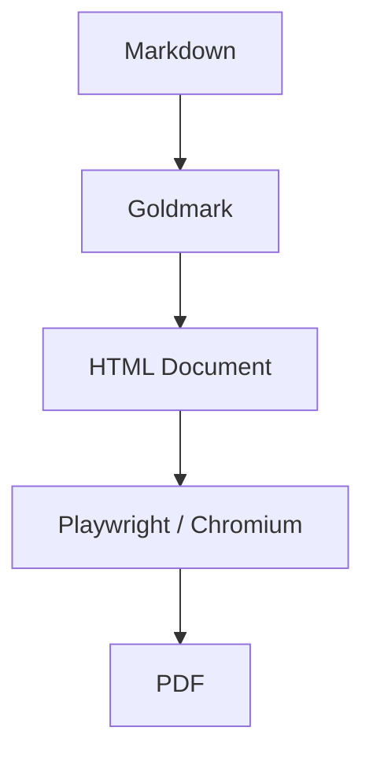

# md2pdf Example

A demonstration document with **bold**, _italic_, and `inline code`.

## Code Block

```go
package main

import "fmt"

func main() {
    fmt.Println("Hello, md2pdf!")
}
```

## Table

| Feature          | Status |
| ---------------- | ------ |
| Markdown         | ✅     |
| Syntax highlight | ✅     |
| Mermaid diagrams | ✅     |
| PDF output       | ✅     |

## Mermaid Diagram



## Blockquote

> Clean Architecture keeps dependencies flowing inward.
> Outer layers depend on inner layers, never the reverse.

## List

1. Parse Markdown with Goldmark
2. Render Mermaid diagrams client-side
3. Generate PDF with headless Chromium
